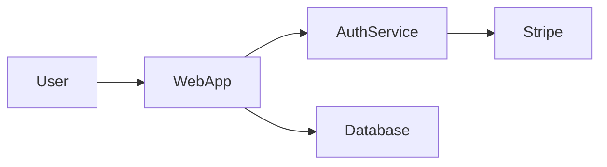

# Phase Change Indexers: Bridging Code to Infrastructure

> **Context**: Extending CCD-REQ-003 analysis
> **Status**: Analysis complete, roadmap proposed
> **Date**: 2026-02-05
> **Author**: Claude (with user review)

---

## Executive Summary

To enable C4 Level 1-2 diagrams (System Context, Containers), we need to index artifacts beyond source code. Code transforms through multiple "phases" before becoming running systems, and each phase has indexable artifacts that reveal architectural information.

This analysis proposes a multi-phase indexing strategy that combines:
1. **Infrastructure as Code** (Terraform, Pulumi, K8s)
2. **Package manifests** (npm, PyPI) + registry metadata
3. **Container definitions** (Dockerfile, docker-compose)
4. **CI/CD pipelines** (GitHub Actions, etc.)
5. **API specifications** (OpenAPI, GraphQL)
6. **Architecture documentation** (Markdown with diagrams, ADRs)

---

## The Phase Change Model

Code goes through transformations before becoming a running system:

```
┌─────────────────────────────────────────────────────────────────────────────┐
│                           PHASE CHANGES                                      │
│                                                                              │
│  SOURCE CODE ──▶ ARTIFACTS ──▶ IMAGES ──▶ SERVICES ──▶ INFRASTRUCTURE       │
│       │              │            │           │              │               │
│   Armada         Build        Container    Deploy         IaC               │
│   (current)      Scripts      Registries   Scripts       (Terraform)        │
│                                                                              │
│  ═══════════════════════════════════════════════════════════════════════    │
│  C4 Level 4     ────────────────────────────────────────▶  C4 Level 1       │
│  (Code)                                                    (Context)         │
└─────────────────────────────────────────────────────────────────────────────┘
```

Each phase has artifacts that inform the next level of architectural understanding:

| Phase | Artifacts | Informs C4 Level |
|-------|-----------|------------------|
| Source Code | `.ts`, `.py`, `.go` files | Level 4 (Code) |
| Build | `package.json`, build scripts | Level 3-4 |
| Container | Dockerfile, docker-compose | Level 2-3 (Container) |
| Deploy | K8s manifests, Helm charts | Level 2 (Container) |
| Infrastructure | Terraform, Pulumi | Level 1-2 (Context, Container) |

---

## Indexer Categories

### 1. Infrastructure as Code (IaC)

| Format | Parser Status | What It Reveals |
|--------|---------------|-----------------|
| **Terraform** (.tf) | HCL parser available (Go) | Cloud resources, external services, network topology |
| **Pulumi** | TypeScript/Python (Armada can parse) | Same as Terraform, in familiar languages |
| **CloudFormation** | YAML/JSON (trivial) | AWS-specific resources |
| **CDK** | TypeScript/Python (Armada can parse) | Infrastructure via code |
| **Bicep** | Custom DSL (parser needed) | Azure resources |

**Key entities to extract**:

```hcl
# terraform/main.tf
resource "aws_rds_instance" "auth_db" {
  engine = "postgres"
  ...
}

resource "aws_lambda_function" "auth_handler" {
  function_name = "auth-service"
  handler       = "dist/handler.main"
  ...
}

resource "aws_sqs_queue" "notifications" {
  name = "notification-queue"
}
```

**Extracted**:
- `aws_rds_instance.auth_db` → "Database (Postgres)" [Container]
- `aws_lambda_function.auth_handler` → "Serverless function" [Container]
- `aws_sqs_queue.notifications` → "Message queue" [Container]
- External service references (Stripe API keys in secrets) → [External System]

---

### 2. Package Manifests + Registry Metadata

| Format | What It Reveals |
|--------|-----------------|
| **package.json** | Dependencies, scripts, entry points |
| **pyproject.toml** / requirements.txt | Python deps |
| **go.mod** | Go modules |
| **Cargo.toml** | Rust crates |
| **pom.xml** / build.gradle | Java/JVM deps |

**Registry queries** can enrich dependency data:

```json
// package.json
{
  "dependencies": {
    "stripe": "^12.0.0",
    "@aws-sdk/client-s3": "^3.0.0",
    "redis": "^4.0.0"
  }
}
```

**npm registry query for `stripe`**:
```json
{
  "name": "stripe",
  "description": "Stripe API wrapper",
  "keywords": ["payments", "stripe", "api"]
}
```

**Inference chain**:
```
package.json: "stripe": "^12.0.0"
  └─▶ npm registry: "Stripe API wrapper" + keywords: ["payments"]
       └─▶ Infer: External System "Stripe" (Payment processing)
            └─▶ Armada: which files import 'stripe'?
                 └─▶ Link: StripeClient.ts uses External:Stripe
```

---

### 3. Container Definitions

| Format | What It Reveals |
|--------|-----------------|
| **Dockerfile** | Base image, build stages, exposed ports, entry point |
| **docker-compose.yml** | Service topology, networks, volumes |
| **Kubernetes manifests** | Deployments, services, ingress, config |
| **Helm charts** | Parameterized K8s with values |

**Dockerfile example**:
```dockerfile
FROM node:20-alpine
WORKDIR /app
COPY package*.json ./
RUN npm ci --production
COPY dist/ ./dist/
EXPOSE 3000
CMD ["node", "dist/server.js"]
```

**Extracted**:
- Base: `node:20-alpine` (Node.js runtime)
- Entry: `dist/server.js` → link to Armada symbol
- Port: `3000` → HTTP service
- Build artifact: `dist/` directory

**Kubernetes example**:
```yaml
apiVersion: apps/v1
kind: Deployment
metadata:
  name: auth-service
  labels:
    app: auth
spec:
  replicas: 3
  template:
    spec:
      containers:
      - name: auth
        image: myregistry/auth-service:v1.2.3
        ports:
        - containerPort: 3000
        env:
        - name: DATABASE_URL
          valueFrom:
            secretKeyRef:
              name: auth-secrets
              key: database-url
```

**Extracted**:
- Service: `auth-service` [Container]
- Image: `myregistry/auth-service:v1.2.3` → link to Dockerfile
- Port: `3000` → API boundary
- Secret: `DATABASE_URL` → database dependency

---

### 4. CI/CD Pipelines

| Format | What It Reveals |
|--------|-----------------|
| **GitHub Actions** (.github/workflows/) | Build → test → deploy workflow |
| **GitLab CI** (.gitlab-ci.yml) | Stages, environments, artifacts |
| **Jenkinsfile** | Pipeline structure |
| **ArgoCD** | GitOps deployment targets |

**GitHub Actions example**:
```yaml
name: Deploy
on:
  push:
    branches: [main]

jobs:
  deploy:
    runs-on: ubuntu-latest
    steps:
      - uses: actions/checkout@v4
      - run: npm ci && npm run build
      - run: docker build -t auth-service .
      - run: docker push ${{ secrets.REGISTRY }}/auth-service
      - run: kubectl apply -f k8s/
```

**Extracted**:
- Build artifact: `auth-service` Docker image
- Deployment method: Kubernetes (`kubectl apply`)
- Deployment target: from `k8s/` manifests
- Registry: from secrets (external dependency)

---

### 5. API Specifications

| Format | What It Reveals |
|--------|-----------------|
| **OpenAPI/Swagger** | REST endpoints, request/response schemas |
| **GraphQL schema** | Types, queries, mutations |
| **Protobuf** (.proto) | gRPC services and messages |
| **AsyncAPI** | Event-driven interfaces |

**OpenAPI example**:
```yaml
openapi: 3.0.0
info:
  title: Auth Service API
paths:
  /auth/login:
    post:
      operationId: loginUser
      requestBody:
        content:
          application/json:
            schema:
              $ref: '#/components/schemas/LoginRequest'
      responses:
        '200':
          content:
            application/json:
              schema:
                $ref: '#/components/schemas/AuthToken'
```

**Linking to Armada**:
- `operationId: loginUser` → search Armada for `loginUser` function
- Request/response schemas → link to TypeScript interfaces
- API boundaries define service contracts

---

### 6. Architecture Documentation

| Format | What It Reveals |
|--------|-----------------|
| **README.md** | High-level overview, architecture diagrams |
| **ADRs** (docs/adr/) | Design decisions, rationale |
| **Mermaid/PlantUML in docs** | Existing diagrams (parse directly!) |
| **Confluence/Notion** | Team knowledge (API access varies) |

#### Strategy A: Parse Existing Diagrams

Many teams embed Mermaid in markdown:

```markdown
## Architecture

The system consists of three main services:


```

**Coral already parses Mermaid!** We can:
1. Glob for `*.md` files
2. Extract mermaid code blocks
3. Parse into GraphIR
4. Merge with Armada's code knowledge
5. Detect drift between docs and code

#### Strategy B: Extract Entities from Prose (NLP/LLM)

```markdown
The AuthService handles user authentication via OAuth2.
It integrates with Stripe for payment verification and
stores session data in Redis.
```

**LLM extraction prompt**:
```
Extract architectural entities from this text:
- Services/components (link to code if possible)
- External systems (third-party services)
- Infrastructure (databases, caches, queues)
- Protocols/patterns

Return as structured JSON.
```

**Extracted**:
```json
{
  "services": [
    { "name": "AuthService", "possibleArmadaMatch": "src/auth/" }
  ],
  "externalSystems": [
    { "name": "Stripe", "purpose": "payment verification" }
  ],
  "infrastructure": [
    { "name": "Redis", "type": "cache", "purpose": "session storage" }
  ],
  "protocols": ["OAuth2"]
}
```

#### Strategy C: Link API Specs to Code

OpenAPI defines contracts; Armada knows implementations:

```yaml
paths:
  /auth/login:
    post:
      operationId: loginUser
```

**Armada query**: Find function named `loginUser` or decorated with `@Route('/auth/login')`

---

## The Linking Problem

The hardest challenge: connecting artifacts across phases.

| Link Type | Example | Difficulty |
|-----------|---------|------------|
| Terraform → Code | `aws_lambda.auth` → `src/auth/handler.ts` | Medium |
| K8s → Dockerfile | `deployment/auth` → `Dockerfile.auth` | Medium |
| Dockerfile → Code | `COPY dist/` → which source? | Low |
| npm dep → Code | `stripe` → which files import it? | Low (Armada knows) |
| Doc diagram → Code | "AuthService" box → `src/auth/` | Medium |

### Linking Strategies

| Strategy | How It Works | Reliability |
|----------|--------------|-------------|
| **Explicit reference** | Terraform `source = "./src/auth"` | High |
| **Import tracing** | Armada knows who imports `stripe` | High |
| **Naming convention** | `auth-service` matches `src/auth/` | Medium |
| **Co-location** | Dockerfile in same dir as package.json | Medium |
| **Annotation/labels** | K8s `app.coral/code-path: src/auth` | High |
| **User confirmation** | "Is this the code for auth-service?" | Highest |

### Cross-Phase Link Model

```typescript
interface CrossPhaseLink {
  source: {
    phase: 'code' | 'artifact' | 'container' | 'deploy' | 'infra' | 'docs';
    id: string;           // Armada symbol ID, resource ID, etc.
    file?: string;        // Source file
  };
  target: {
    phase: 'code' | 'artifact' | 'container' | 'deploy' | 'infra' | 'docs';
    id: string;
    file?: string;
  };
  confidence: number;     // 0.0 - 1.0
  linkMethod: 'explicit' | 'naming' | 'heuristic' | 'import' | 'user';
  evidence?: string;      // Why this link exists
}

// Examples:
{
  source: { phase: 'infra', id: 'aws_lambda.auth', file: 'terraform/lambda.tf' },
  target: { phase: 'code', id: 'scip:src/auth/handler.ts:main', file: 'src/auth/handler.ts' },
  confidence: 0.95,
  linkMethod: 'explicit',
  evidence: 'Terraform handler = "dist/handler.main" matches export'
}

{
  source: { phase: 'code', id: 'scip:src/payments/stripe.ts:StripeClient' },
  target: { phase: 'external', id: 'stripe-api' },
  confidence: 0.9,
  linkMethod: 'import',
  evidence: 'File imports "stripe" package (payment processing SDK)'
}
```

---

## Proposed Architecture

```
┌─────────────────────────────────────────────────────────────────────────────┐
│                         MULTI-PHASE INDEXER                                  │
│                                                                              │
│  ┌─────────────┐  ┌─────────────┐  ┌─────────────┐  ┌─────────────┐        │
│  │   Armada    │  │  IaC Index  │  │ Manifest    │  │  Doc Index  │        │
│  │  (code)     │  │ (terraform) │  │ Index (npm) │  │ (markdown)  │        │
│  │             │  │ (k8s)       │  │ (docker)    │  │ (openapi)   │        │
│  └──────┬──────┘  └──────┬──────┘  └──────┬──────┘  └──────┬──────┘        │
│         │                │                │                │                │
│         └────────────────┴────────────────┴────────────────┘                │
│                                    │                                         │
│                            ┌───────▼───────┐                                │
│                            │    LINKER     │                                │
│                            │               │                                │
│                            │ • Explicit    │                                │
│                            │ • Import      │                                │
│                            │ • Naming      │                                │
│                            │ • Heuristic   │                                │
│                            │ • User        │                                │
│                            └───────┬───────┘                                │
│                                    │                                         │
│                            ┌───────▼───────┐                                │
│                            │ Unified Graph │                                │
│                            │               │                                │
│                            │ • Code nodes  │                                │
│                            │ • Infra nodes │                                │
│                            │ • External    │                                │
│                            │ • Links       │                                │
│                            └───────────────┘                                │
└─────────────────────────────────────────────────────────────────────────────┘
```

---

## Example: Full-Stack Tracing

Given a codebase with:
- `src/auth/` (TypeScript code)
- `terraform/` (infrastructure)
- `Dockerfile` (container)
- `k8s/` (Kubernetes manifests)
- `README.md` (with Mermaid diagram)
- `package.json` (with dependencies)

### Unified Multi-Level View

```
┌─────────────────────────────────────────────────────────────────┐
│ C4 LEVEL 1: SYSTEM CONTEXT                                       │
│ Sources: README.md, terraform/*.tf, package.json                 │
│                                                                  │
│        ┌────────┐                                                │
│        │  User  │                                                │
│        └───┬────┘                                                │
│            │                                                     │
│            ▼                                                     │
│   ┌────────────────┐         ┌─────────────┐                    │
│   │   Our System   │────────▶│   Stripe    │                    │
│   │                │         │  (payments) │                    │
│   └───────┬────────┘         └─────────────┘                    │
│           │                                                      │
│           ▼                                                      │
│   ┌────────────────┐                                            │
│   │   PostgreSQL   │                                            │
│   │   (AWS RDS)    │                                            │
│   └────────────────┘                                            │
├─────────────────────────────────────────────────────────────────┤
│ C4 LEVEL 2: CONTAINERS                                           │
│ Sources: terraform/*.tf, k8s/*.yaml, Dockerfile                  │
│                                                                  │
│   ┌─────────────────┐      ┌─────────────────┐                  │
│   │ Lambda:         │      │ RDS:            │                  │
│   │ auth-handler    │─────▶│ auth-db         │                  │
│   │ (Node.js)       │      │ (Postgres)      │                  │
│   └────────┬────────┘      └─────────────────┘                  │
│            │                                                     │
│            │ HTTPS                                               │
│            ▼                                                     │
│   ┌─────────────────┐                                           │
│   │ External:       │                                           │
│   │ Stripe API      │                                           │
│   └─────────────────┘                                           │
├─────────────────────────────────────────────────────────────────┤
│ C4 LEVEL 3: COMPONENTS                                           │
│ Sources: Armada (src/auth/)                                      │
│                                                                  │
│   ┌─────────────┐      ┌───────────────┐                        │
│   │ AuthService │─────▶│ TokenManager  │                        │
│   └──────┬──────┘      └───────────────┘                        │
│          │                                                       │
│          ▼                                                       │
│   ┌──────────────┐     ┌───────────────┐                        │
│   │ UserRepository│    │ StripeClient  │────▶ [Stripe API]      │
│   └──────────────┘     └───────────────┘                        │
└─────────────────────────────────────────────────────────────────┘
```

---

## Implementation Roadmap

### Phase A: Quick Wins (2-3 weeks)

| Indexer | Effort | Value | Notes |
|---------|--------|-------|-------|
| **Mermaid in Markdown** | Low | High | Coral already parses Mermaid |
| **package.json deps** | Low | Medium | JSON, identify external systems |
| **OpenAPI specs** | Low | Medium | YAML/JSON, link to code |
| **Dockerfile basics** | Medium | Medium | Custom parser, entry points |

**Deliverable**: Detect external systems from deps, parse existing diagrams from docs

### Phase B: Infrastructure (4-6 weeks)

| Indexer | Effort | Value | Notes |
|---------|--------|-------|-------|
| **Terraform** | Medium | High | HCL parser (use existing Go lib via WASM?) |
| **Kubernetes YAML** | Medium | High | Standard YAML parsing |
| **docker-compose** | Low | Medium | YAML |
| **GitHub Actions** | Medium | Medium | YAML with complex structure |

**Deliverable**: Full infrastructure topology from IaC

### Phase C: Intelligence (6-8 weeks)

| Indexer | Effort | Value | Notes |
|---------|--------|-------|-------|
| **Registry queries** | Medium | Medium | npm/PyPI APIs for metadata |
| **Doc NLP extraction** | High | Medium | LLM-based entity extraction |
| **Cross-phase linker** | High | High | The glue that connects everything |
| **Confidence UI** | Medium | High | Show/confirm low-confidence links |

**Deliverable**: Unified multi-phase graph with confidence scoring

---

## Open Questions

### 1. Where Does This Live?

| Option | Pros | Cons |
|--------|------|------|
| **Extend Armada** | Single source of truth, existing infra | Scope creep, different indexing needs |
| **Separate meta-indexer** | Clean separation, can evolve independently | Another service to run |
| **Coral-specific** | Focused on visualization needs | Duplicates some Armada work |

**Recommendation**: Start as Coral-specific tooling, consider merging into Armada if successful.

### 2. How to Handle Confidence?

| Approach | UX |
|----------|-----|
| **Threshold filter** | Only show links above 0.7 confidence |
| **Visual indicator** | Dashed lines for low confidence |
| **Confirmation flow** | Prompt user to confirm uncertain links |
| **Learn from user** | User corrections improve future linking |

**Recommendation**: Visual indicators + optional confirmation for links < 0.7

### 3. What's the MVP?

**Minimal viable indexers**:
1. Mermaid parsing (already done in Coral)
2. package.json → external system detection
3. Terraform resources → infrastructure nodes

**Deferred**:
- NLP extraction from prose
- Registry queries
- Full cross-phase linking with confidence

---

## Relationship to CCD-REQ-003

This analysis extends CCD-REQ-003 by defining:

1. **What "Codebase Overview" actually means** across C4 levels
2. **Data sources** beyond Armada needed for Levels 1-2
3. **Linking strategy** to connect code to infrastructure
4. **Implementation path** from quick wins to full intelligence

CCD-REQ-003 should be updated to reflect:
- Dependency on phase-change indexers for Level 1-2 diagrams
- Armada-only scope for Level 3-4 diagrams (current capability)
- Roadmap for progressive enhancement

---

## References

- [CCD-REQ-003 Analysis](./CCD-REQ-003-diagram-types-analysis.md)
- [C4 Model](https://c4model.com/)
- [Terraform HCL](https://github.com/hashicorp/hcl)
- [OpenAPI Specification](https://spec.openapis.org/oas/latest.html)
- [SCIP (Armada symbol format)](https://sourcegraph.com/docs/code-intelligence/scip)

---

*This analysis proposes extending Coral's indexing capabilities beyond source code to enable true C4 Level 1-2 diagram generation. Implementation should start with quick wins (Mermaid, package.json) and progressively add infrastructure indexers.*
