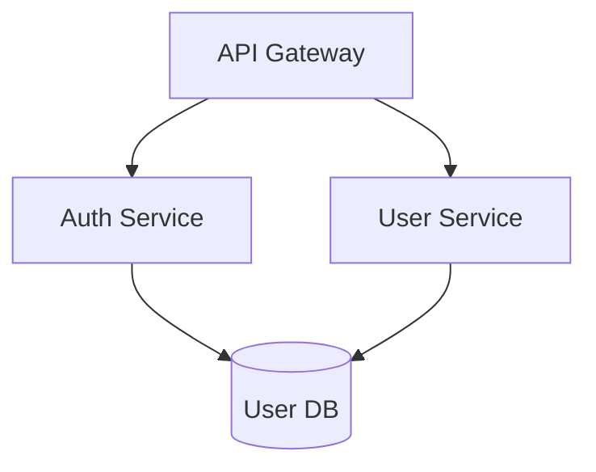
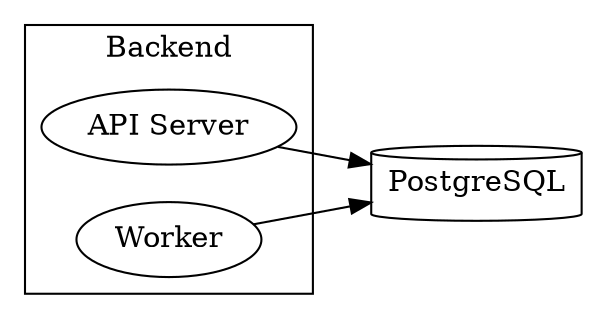
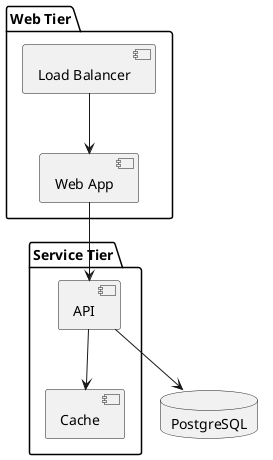

# Format Migration Agent

## Summary

Converts existing diagrams from other formats (Mermaid, Graphviz DOT, PlantUML, draw.io XML) into Coral's Graph-IR and DSL. This agent reduces adoption friction by allowing users to migrate their existing diagram libraries to Coral.

## Value Proposition

- **Reduces adoption barrier**: Users don't start from scratch
- **Preserves investment**: Existing diagrams aren't abandoned
- **Enables comparison**: Side-by-side comparison of original vs Coral output
- **One-time migration**: Convert once, maintain in Coral going forward

## Use Cases

### UC1: Mermaid Migration
Team has 50 Mermaid diagrams in their docs/ folder.

```
User: "Convert all Mermaid files in docs/ to Coral DSL"

Agent: [parses each .mmd file, converts to Graph-IR, writes .coral files]
```

### UC2: Single Diagram Conversion
User wants to convert one diagram interactively.

```
User: "Convert this Mermaid to Coral:
       graph TD
         A[API Gateway] --> B[Auth Service]
         A --> C[User Service]"

Agent: [outputs Coral DSL equivalent]
```

### UC3: Graphviz DOT Migration
Legacy system has Graphviz diagrams generated by documentation tools.

```
User: "Convert architecture.dot to Coral"

Agent: [parses DOT syntax, extracts nodes/edges, generates Graph-IR]
```

### UC4: PlantUML Migration
Enterprise team uses PlantUML for UML diagrams.

```
User: "Convert our PlantUML component diagrams to Coral"

Agent: [handles PlantUML's component/package syntax, maps to Coral types]
```

### UC5: draw.io XML Migration
Team has draw.io diagrams they want to convert.

```
User: "Extract the architecture from this draw.io file"

Agent: [parses XML, identifies shapes/connectors, generates Graph-IR]
```

## Interface

### Input

```typescript
interface FormatMigrationInput {
  /** Source format */
  format: 'mermaid' | 'graphviz' | 'plantuml' | 'drawio';

  /** Source content (string) or file path */
  source: string | { path: string };

  /** For batch conversion: directory path */
  directory?: string;

  /** File patterns for batch conversion */
  patterns?: string[];  // e.g., ["**/*.mmd", "**/*.puml"]

  /** Conversion options */
  options?: {
    /** Preserve original IDs where possible */
    preserveIds?: boolean;
    /** Map source types to Coral types */
    typeMapping?: Record<string, NodeType>;
    /** Include position hints in metadata (for draw.io) */
    includePositions?: boolean;
    /** How to handle unsupported features */
    unsupportedFeatures?: 'warn' | 'error' | 'skip';
  };
}
```

### Output

```typescript
interface FormatMigrationOutput {
  /** Generated Graph-IR */
  graph: CoralGraph;

  /** Coral DSL representation */
  dsl: string;

  /** Conversion report */
  report: {
    /** Source format detected */
    sourceFormat: string;
    /** Nodes converted */
    nodesConverted: number;
    /** Edges converted */
    edgesConverted: number;
    /** Features that couldn't be converted */
    unsupportedFeatures: UnsupportedFeature[];
    /** Warnings during conversion */
    warnings: string[];
  };

  /** For batch conversion: results per file */
  batchResults?: Array<{
    sourcePath: string;
    outputPath: string;
    success: boolean;
    error?: string;
  }>;
}

interface UnsupportedFeature {
  feature: string;
  location?: string;
  suggestion?: string;
}
```

## Behavior

### Format Detection
If format is not specified, detect from:
- File extension: `.mmd`, `.mermaid` → Mermaid; `.dot`, `.gv` → Graphviz; `.puml`, `.plantuml` → PlantUML; `.drawio`, `.xml` → draw.io
- Content inspection: Look for format-specific markers

### Mermaid Conversion

**Supported diagram types:**
- `graph` / `flowchart` → Full support
- `sequenceDiagram` → Partial (actors and messages)
- `classDiagram` → Partial (classes and relationships)
- `erDiagram` → Partial (entities and relationships)
- `stateDiagram` → Limited

**Mapping rules:**
| Mermaid | Coral |
|---------|-------|
| `A[Label]` | `{ id: "a", type: "service", label: "Label" }` |
| `A[(Database)]` | `{ id: "a", type: "database", label: "Database" }` |
| `A{{External}}` | `{ id: "a", type: "external_api", label: "External" }` |
| `A --> B` | `{ source: "a", target: "b", relation: "dependency" }` |
| `A -.-> B` | `{ source: "a", target: "b", relation: "dependency", metadata: { style: "dashed" } }` |
| `subgraph Name` | Parent node with children |

### Graphviz DOT Conversion

**Supported features:**
- Nodes with labels
- Directed edges (`->`)
- Subgraphs/clusters
- Basic attributes (label, shape)

**Mapping rules:**
| DOT | Coral |
|-----|-------|
| `node [shape=box]` | `type: "service"` |
| `node [shape=cylinder]` | `type: "database"` |
| `node [shape=ellipse]` | `type: "actor"` |
| `A -> B` | `{ source: "A", target: "B" }` |
| `subgraph cluster_X { }` | Parent node with children |

### PlantUML Conversion

**Supported diagram types:**
- Component diagrams
- Deployment diagrams
- Class diagrams (partial)

**Mapping rules:**
| PlantUML | Coral |
|----------|-------|
| `[Component]` | `type: "service"` |
| `database "DB"` | `type: "database"` |
| `actor User` | `type: "actor"` |
| `package "Name" { }` | Parent node with children |
| `A --> B` | `{ source: "a", target: "b" }` |

### draw.io XML Conversion

**Approach:**
1. Parse mxGraphModel XML
2. Identify cells with vertex="1" (nodes) and edge="1" (edges)
3. Extract labels from cell values
4. Determine types from shape styles
5. Reconstruct parent-child relationships from cell hierarchy

**Challenges:**
- draw.io stores visual information (positions, sizes, colors)
- Type inference is heuristic (based on shape)
- Connections may be ambiguous

## Examples

### Example 1: Mermaid Flowchart

**Input (Mermaid):**


**Output (Coral DSL):**
```coral
service "API Gateway"
service "Auth Service"
service "User Service"
database "User DB"

api_gateway -> auth_service
api_gateway -> user_service
auth_service -> user_db [data_flow]
user_service -> user_db [data_flow]
```

### Example 2: Graphviz DOT

**Input (DOT):**


**Output (Coral DSL):**
```coral
group "Backend" {
    service "API Server"
    service "Worker"
}

database "PostgreSQL"

api_server -> postgresql [data_flow]
worker -> postgresql [data_flow]
```

### Example 3: PlantUML Component

**Input (PlantUML):**


**Output (Coral DSL):**
```coral
group "Web Tier" {
    service "Web App"
    service "Load Balancer"
}

group "Service Tier" {
    service "API"
    service "Cache"
}

database "PostgreSQL"

load_balancer -> web_app
web_app -> api
api -> cache
api -> postgresql [data_flow]
```

## Dependencies

### Required
- `@coral/ir` — Graph-IR types and validation
- `@coral/language` — DSL printer

### Format-Specific Parsers
- Mermaid: Custom parser or `mermaid` library's internal parser
- Graphviz: `graphviz-ast` or custom DOT parser
- PlantUML: Custom parser (no good JS library exists)
- draw.io: XML parser (`fast-xml-parser` or `xml2js`)

## Implementation Notes

### Parser Strategy
For each format, choose between:
1. **Use existing library**: If a good parser exists
2. **Tree-sitter grammar**: For well-defined syntax
3. **Custom parser**: For formats with no good parser
4. **Regex extraction**: Last resort for simple cases

### Handling Ambiguity
Different source formats have varying levels of semantic information:
- **Mermaid**: Shape hints at type (cylinder = database)
- **DOT**: Can specify shape explicitly
- **draw.io**: Pure visual, type must be inferred from shape

When type is ambiguous:
1. Default to `service`
2. Add warning to report
3. Allow user to provide type mapping

### Preserving Visual Hints
Some users may want to preserve layout hints:
```json
{
  "id": "api",
  "type": "service",
  "label": "API",
  "metadata": {
    "_migration": {
      "originalFormat": "drawio",
      "position": { "x": 100, "y": 200 },
      "size": { "width": 120, "height": 60 }
    }
  }
}
```

This metadata is ignored by Coral's layout engine but preserved for reference.

## Open Questions

1. **Should we support style migration?**
   - Colors, fonts, line styles
   - Could map to a separate theme file

2. **How to handle format-specific features?**
   - Mermaid has click handlers, links
   - PlantUML has notes, legends
   - Should these become metadata?

3. **Batch conversion strategy?**
   - Parallel processing for large directories
   - Error handling (continue on failure?)
   - Progress reporting

4. **Round-trip support?**
   - Should we also support Coral → Mermaid export?
   - Useful for sharing with teams not using Coral

## Related Specifications

- [diagram-generation agent](diagram-generation.md) — Could enhance migrated diagrams
- [/coral-convert skill](../skills/coral-convert.md) — Interactive version of this agent
