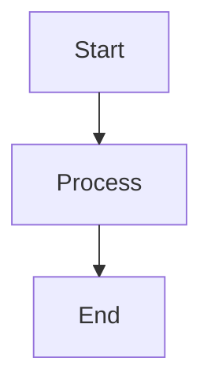
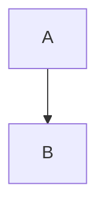

Given the list of diagramming tools that are initially text-based, is there a list of commonly-cited shortcomings of these tools? I have read about non-standard / unstable (or too rigid) syntax, but search for commonly-cited others for this class of diagramming tool.

While "Diagram-as-Code" tools like Mermaid, Graphviz, and PlantUML are celebrated for version control and speed, they come with significant, widely cited trade-offs.

Here are the most common shortcomings for this class of tools, categorized by the type of frustration they cause.

### 1. The "Layout Roulette" (Lack of Spatial Control)

This is by far the #1 complaint. In a drag-and-drop tool, if you move a box to the left, it stays there. In a text-based tool, you are at the mercy of the layout algorithm (often the *Sugiyama method* or similar).

* **Instability:** Adding a single new arrow or node can drastically rearrange the entire graph. A diagram that looked perfect a minute ago might suddenly become a tangled mess because the algorithm decided to re-route everything.
* **Impossible Tweaks:** Users often find themselves fighting the tool to make minor adjustments (e.g., *"I just want this specific node to be slightly higher"*). You end up adding "invisible edges" or hacky spacing characters just to force the algorithm to move a box.
* **Spaghetti at Scale:** These algorithms work well for 10-20 nodes. Once you hit 50+ nodes, the lines often cross chaotically, making the diagram unreadable ("hairball graphs").

### 2. Styling Limitations ("The Developer Aesthetic")

These tools prioritize *structure* over *style*. If you need a high-polish diagram for a client presentation, these tools often fall short.

* **Generic Look:** Diagrams tend to look "engineered" and rigid. Getting away from the default look often requires writing verbose CSS or specific styling attributes that bloat the code.
* **Verbose Styling:** Changing a single arrow color might be easy, but creating a complex visual theme (e.g., "make all database nodes cylindrical, red, and dashed") requires learning a secondary syntax for classes and styles that is often less intuitive than the graph syntax itself.

### 3. The Maintainability Paradox

The selling point is that text is easier to maintain, but this flips when the diagram gets large.

* **Write-Only Code:** A complex sequence diagram with 50 steps looks like a wall of text. Debugging a missing bracket or a typo in a 500-line Mermaid file can be more frustrating than just redrawing a line in a GUI.
* **Mental Parser Fatigue:** When you look at the code, you cannot "see" the diagram. You have to constantly render the preview to understand if `A --> B` is actually pointing where you think it is physically.

### 4. Integration & Rendering Friction

* **Drift:** Because the diagram is manually written text (usually), it drifts from the actual code just as fast as a PNG would. Unless you are generating the Mermaid/Graphviz text *from* your production code automatically, it is still just documentation that goes stale.
* **Environment Dependency:**
* *PlantUML* relies on Java and Graphviz being installed on the server/machine, which makes it heavy.
* *Mermaid* is lighter (JS-based) but often renders differently depending on where you view it (e.g., GitHub's built-in Mermaid renderer might be an older version than your local editor, causing syntax errors).


### Summary Comparison Table

| Feature | **GUI Tools** (Lucidchart, Miro) | **Text Tools** (Mermaid, Graphviz) |
| --- | --- | --- |
| **Precision** | Pixel-perfect control. | Algorithmic "best guess." |
| **Aesthetics** | High (easy to make pretty). | Low (functional/rigid). |
| **Large Graphs** | Tedious to draw manually. | Hard to read (spaghetti layout). |
| **Version Control** | Binary/Blob (hard to diff). | Excellent (text diffs). |
| **Mental Model** | What you see is what you get. | Abstract (Code  Visual). |

---

The short answer is **no, `dagre` is no longer considered "good" by modern standards.** It has been officially **unmaintained** for several years (since roughly 2018), and even the Mermaid maintainers have acknowledged it as a legacy bottleneck.

It has been surpassed by a layout engine called **ELK (Eclipse Layout Kernel)**, specifically its JavaScript port **`elkjs`**.

Here is the breakdown of why `dagre` fell behind and how ELK fixes the "hint" problem.

### 1. Why `dagre` is considered outdated

* **"Dead" Code:** The library is effectively abandoned. It receives no updates, performance improvements, or bug fixes.
* **Strictly Hierarchical:** Dagre is a "one-trick pony." It forces everything into a top-down or left-right hierarchy (Sugiyama method). If you try to model something that *isn't* a hierarchy (like a circular network or a database cluster), Dagre struggles to render it cleanly.
* **No "Ports" Concept:** In Dagre, an arrow points to the "node." It usually lands wherever the math says is easiest (often the top center). You cannot easily say, "connect this line specifically to the *bottom-right corner* of Box A."

### 2. The Successor: ELK (Eclipse Layout Kernel)

The industry (including Mermaid) is moving toward **ELK**. It is a heavy-duty layout engine originally written in Java for the Eclipse IDE but now compiled to JavaScript (`elkjs`).

**Does it allow for layout "hints"?**
**Yes.** This is ELK's defining feature. Unlike Dagre, which is a "black box" (you give it nodes, it spits out a graph), ELK accepts a massive configuration object that acts as a set of constraints or "hints."

#### The "Hints" ELK Supports:

* **Port Constraints:** You can specify exactly where an edge should attach.
* *Hint:* `portSide: NORTH` (Force the arrow to leave from the top).
* *Hint:* `portConstraints: FIXED_ORDER` (Keep inputs on the left, outputs on the right, in a specific order).


* **Direction Hints per Group:** You can have a main graph flowing Left-to-Right, but a specific subgraph (cluster) flowing Top-to-Bottom. Dagre cannot do this (it applies one direction globally).
* **Node Partitioning (Swimlanes):** You can hint that certain nodes belong to a specific "partition" (like a vertical column), and ELK will force them to stay there while still optimizing the arrows.
* **Crossing Minimization:** You can control the strategy for how aggressively it tries to untangle lines (e.g., `interactive` vs. `layer` strategies).

### 3. How to use ELK in Mermaid today

Mermaid has recently added **experimental support** for ELK. You don't need to install a new tool; you just need to change the renderer in your Mermaid configuration.

**The "Magic" Config:**
If you add this directive to the top of your Mermaid flowchart, it switches the engine from Dagre to ELK:



*Note: Because Mermaid is still "wrapping" ELK, it doesn't expose **all** of ELK's advanced hints (like complex port constraints) in the simple Mermaid syntax yet. However, this switch alone often solves complex "spaghetti" layouts that choke Dagre.*

### Summary Comparison

| Feature | **Dagre** (Default) | **ELK** (The New Standard) |
| --- | --- | --- |
| **Status** | Unmaintained (2018) | Actively Developed |
| **Philosophy** | "Best guess" automation. | "Constraint-based" layout. |
| **Hints** | Minimal (RankDir only). | **Extensive** (Ports, Partitions, node order). |
| **Complex Graphs** | Often tangle (hairballs). | Handles complex nesting well. |

---

The short answer is: **No, developers do not have "brain space" for a new syntax, but they are desperate for a better output.**

The market for "manual diagramming" is saturated and shrinking. However, the market for **"AI-native diagramming"** is wide open.

Here is the breakdown of why the "Brain Space" argument has shifted and where the actual opportunity lies.

### 1. The "Brain Space" Paradox

If you launch a tool today that requires a human to learn a new syntax (e.g., `box "A" -> box "B"`), it will likely fail.

* **Mermaid is the "MP3" of diagrams:** It isn't the best quality, but it plays everywhere (GitHub, Notion, GitLab, Azure DevOps).
* **Inertia is King:** Developers will tolerate Mermaid’s ugly default arrows because they render natively in their `README.md` without installing a plugin.

**Conclusion:** If your tool requires a plugin to view the result, you have already lost 90% of the market.

### 2. The "AI-Native" Opportunity

The user behavior has changed. Developers are no longer **writing** Mermaid; they are **prompting** AI to write it for them.

* **The Problem:** Mermaid was designed for humans to type. It is actually quite brittle for AI. Large Language Models often "hallucinate" invalid Mermaid syntax, or the graph becomes a "spaghetti hairball" because the AI cannot "see" the spatial layout it is creating.
* **The Opportunity:** A diagramming tool designed specifically as an **intermediate layer for AI**.
* *Constraint:* The syntax should be mathematically robust (hard for AI to break).
* *Feature:* It should support "progressive disclosure" (drill-down). AI generates too much detail; humans need to click a box to see the sub-system. Mermaid cannot do this easily.


### 3. Recent Entrants & Their Fate

To see if there is room, look at who tried recently:

| Tool | Hook | Fate |
| --- | --- | --- |
| **D2 (Declarative Diagramming)** | "Mermaid but with good layout & SQL support." | **Niche Success.** Loved by architects for its aesthetic engine, but struggles to displace Mermaid because GitHub doesn't render it natively yet. |
| **Ilograph** | "Interactive, zoomable diagrams." | **Struggling.** The output is amazing (drill-down maps), but the proprietary syntax/hosting model creates friction. |
| **Diagrams (Python)** | "Draw Cloud Architecture using Python code." | **High Success.** Why? Because it uses *Python*, a language devs already know. No "new syntax" required. |

### 4. What would a "Killer" entrant look like?

If you wanted to steal the market, you wouldn't build "Better Mermaid." You would build **"Google Maps for Code."**

* **No New Syntax:** It uses JSON/YAML or a standard language (TypeScript/Python).
* **Interactive by Default:** The output isn't a static PNG/SVG. It is a web component where clicking "API Gateway" zooms you into the endpoints.
* **Source-Linked:** It doesn't drift. It links directly to the GitHub line numbers.

### Recommendation

If you are looking for a tool to *use*, stick to **Mermaid** (for documentation) or **D2** (if you need pretty exports for slides).

If you are looking for a tool to *build/invest in*, look for **interactive, zoomable visualization tools** that AI can generate automatically from codebase analysis. That is the vacuum currently waiting to be filled.

This is the deeper reality of why "Code-First" diagramming is currently hitting a ceiling and exactly what is required to break through it.

### Expansion on Point 2: The "AI-Native" Opportunity

**The Problem: Large Language Models (LLMs) are "Spatial Hallucinators."**
Mermaid was designed for humans to write, but it forces the writer to be a layout engine. When you ask an LLM to "draw a complex architecture," it struggles because:

1. **Probabilistic vs. Deterministic Layout:** An LLM predicts the next *token* (word), not the next *pixel*. It cannot "see" that adding `Node Z` to the left of `Node A` will cause a line to cross 5 other lines and create a "spaghetti" mess.
2. **Syntax Fragility:** If an LLM misses a single bracket in Mermaid, the entire render fails (Red Box of Death). This requires a "repair loop" where the AI has to read the error and try again, wasting tokens and time.

**The Solution: An "Intermediate Representation" (IR) Layer.**
The "Killer" tool for AI won't be a drawing language; it will be a **Data Protocol**.

* **Don't write:** `A --> B` (Visual instruction)
* **Do write:** `{"source": "A", "target": "B", "relationship": "depends_on"}` (Structural fact)

AI agents excel at generating structured **JSON** or **YAML**. A new entrant should accept a raw JSON payload describing the *system state* and use a deterministic engine (like ELK) to render it. This decouples the "truth" of the architecture from the "drawing" of the arrows.

### Expansion on Point 4: The "Google Maps for Code"

**The Problem: The "Flat Artifact" Paradox.**
Current tools (Mermaid, Graphviz) generate a **static image** (SVG/PNG). This forces you to choose between two bad options:

1. **High-Level Overview:** Clean but useless for debugging (too vague).
2. **Detailed Implementation:** Accurate but unreadable (too dense).

**The Solution: Interactive "Drill-Down" (The C4 Model on Steroids).**
We don't need better *drawing* tools; we need **Code Browsers**. The "Google Maps" approach means the diagram is not an image; it is a **viewport** into your codebase.

#### Feature A: "Infinite Zoom" (Progressive Disclosure)

Imagine a box labeled `Billing Service`.

* **Zoom Level 1:** It connects to `User DB` and `Stripe API`.
* **Zoom Level 2 (Click):** The box expands to show internal modules (`InvoiceGenerator`, `PaymentRetryQueue`).
* **Zoom Level 3 (Click):** You see the specific Classes/Functions inside `InvoiceGenerator`.

**Why this wins:** The AI doesn't have to decide "how much detail to show." It generates *all* the detail into the data model, and the *UI* handles the complexity by hiding the deep stuff until you ask for it.

#### Feature B: The "Drift-Proof" Pipeline (LSP Integration)

The biggest lie in software engineering is a diagram titled "Architecture_Final.png". The moment code is committed, that PNG is a lie.

A modern tool would not be written by hand. It would hook into the **Language Server Protocol (LSP)**—the same tool VS Code uses to give you autocomplete.

1. **Analyze:** The tool scans your Python/TypeScript code.
2. **Extract:** It automatically finds that `class Checkout` calls `stripe.charge()`.
3. **Generate:** It updates the "map" automatically in the CI/CD pipeline.
4. **Result:** Your diagram is never "drawn"; it is **rendered** fresh from the commit hash.

### Summary of the Market Gap

The "Brain Space" argument is valid only if you ask developers to learn a new *drawing* language.
If you offer them a **self-updating, interactive map** that their AI agents can populate automatically via JSON, they will not just make space for it—they will become dependent on it.

* **Existing "Almost" Solutions:**
* **Structurizr:** Does the "Data Model" part well, but the UI is dated.
* **IcePanel:** Does the "Zooming" part well, but is proprietary/SaaS-heavy.
* **D2:** Does the "Aesthetics" well, but is still static.

Yes, this is absolutely possible. In fact, you have just described the architecture of the **next generation of diagramming tools**.

If we treat diagrams as "compiled software" rather than "drawn pictures," we move away from visual DSLs (like Mermaid) toward a structural **Graph Intermediate Representation (Graph-IR)**.

Here is what that specification looks like, why it must be a DAG, and how it remains "simple enough" for an AI to write but "complete enough" to run.

### 1. The Philosophy: "Semantics, not Pixels"

Current tools (Mermaid/PlantUML) force the AI to mix **Semantics** (Connection) with **layout** (Direction).

* *Mermaid:* `A --> B` (Implies: A is connected to B **AND** A is to the left/top of B).
* *Graph-IR:* `{"source": "A", "target": "B"}` (Implies: Connection only. The renderer decides where they go).

To be "complete enough," the IR needs to capture three things:

1. **Identity & Hierarchy** (Who am I, and who is my parent?)
2. **Connectivity** (Who do I talk to?)
3. **Metadata** (What happens when I click you?)

### 2. The Specification (The JSON Schema)

Here is a hypothetical "Graph-IR" that is robust enough for a compiler but simple enough for an LLM to generate reliably.

```json
{
  "graph_ir_version": "1.0",
  "root": {
    "nodes": [
      {
        "id": "checkout_service",
        "type": "service",
        "label": "Checkout Service",
        "meta": { "language": "python", "repo": "github.com/corp/checkout" },
        "children": [
          { "id": "payment_handler", "type": "module", "label": "Payment Handler" },
          { "id": "cart_manager", "type": "module", "label": "Cart Manager" }
        ]
      },
      {
        "id": "stripe_api",
        "type": "external_api",
        "label": "Stripe API"
      }
    ],
    "edges": [
      {
        "source": "payment_handler",
        "target": "stripe_api",
        "relation": "https_post",
        "label": "Charges Card"
      },
      {
        "source": "checkout_service",
        "target": "payment_handler",
        "relation": "internal_call"
      }
    ]
  }
}

```

#### Why this works for AI (The "Simplicity" Test):

* **No "Syntax Errors":** It is just JSON. Every LLM outputs valid JSON natively.
* **UUIDs vs. Layout:** The AI doesn't need to know *where* `payment_handler` is. It just needs to know it *exists*.
* **Nested Context:** The `children` array handles the complex concept of "Zoom" without any complex coordinate math.

### 3. Why it must be a DAG (The "Completeness" Test)

You mentioned the specification being a **DAG (Directed Acyclic Graph)**. This is mathematically critical for the "Compile" step.

If the IR is a DAG, the compiler (the layout engine) can guarantee **Topological Sort**.

* **Compiler Logic:** "If A depends on B, B must be drawn *after* (or below) A."
* **Loop Handling:** Real systems have loops (Service A calls B, B calls A). A DAG-based IR forces the compiler to detect these "Back Edges" and render them differently (e.g., as a dashed red line going *up* against the flow), which prevents the layout engine from crashing or infinite-looping.

### 4. The "Compiler" Stack

If the AI writes the JSON above, what "compiles" it?
You don't need to invent this. The stack already exists, just disconnected:

1. **The Source:** AI Agent scans code -> outputs `Graph-IR (JSON)`.
2. **The Compiler:** **ELK (Eclipse Layout Kernel)**.
* ELK takes the JSON.
* It runs the "Layered" algorithm (Sugiyama).
* It outputs a new JSON with `x`, `y`, `width`, `height` for every node.


3. **The Renderer:** React Flow / Svelte Flow.
* It takes the `x, y` coordinates and draws the boxes.


### 5. Summary: The "Graph-IR" vs. Mermaid

| Feature | **Mermaid (Current)** | **Graph-IR (Future)** |
| --- | --- | --- |
| **Unit of Atom** | The Visual Instruction (`-->`) | The Semantic Fact (`source`, `target`) |
| **Drill Down** | Impossible (Flat image) | Native (Nested `children` arrays) |
| **Styling** | Hardcoded in syntax | Decoupled (CSS controls the renderer) |
| **Writer** | Human (Manual) | AI / LSP (Automated) |


---

### 1. Can the spec be written and verified using Tree-sitter?

**Short Answer:** Tree-sitter is the wrong tool for **verifying** a JSON spec, but it is the perfect tool for **building the editor experience** if you decide to give your Graph-IR a human-readable syntax (DSL) instead of raw JSON.

**The Distinction:**

* **Tree-sitter is a Parser Generator:** It takes a stream of text and turns it into a Syntax Tree. It answers the question: *"Is this text grammatically correct according to the language rules?"*
* **JSON Schema is a Validator:** It takes a JSON object and checks data types, required fields, and constraints. It answers the question: *"Does this object have a valid `id` field and is `children` an array?"*

**Verdict:**
If your "Graph-IR" is raw JSON (as discussed), use **JSON Schema** to verify it. Tree-sitter would be overkill and ineffective for data validation.

**However**, if you want to support a text DSL (like `service "Checkout" { ... }`) that *compiles* to your Graph-IR, then **Tree-sitter is excellent**. You would write a `grammar.js` definition for your DSL. This gives you:

1. **Live Syntax Validation:** Red squiggles in the editor as the user types.
2. **Syntax Highlighting:** Colors for your custom keywords.
3. **Code Folding:** Ability to collapse nodes in the editor.

### 2. Can Mermaid syntax be compiled to the Graph-IR?

**Yes.** This is the classic "Compiler Frontend" pattern. In fact, this is exactly how you would migrate legacy users to your new tool.

You would treat Mermaid not as a rival tool, but as a **legacy input language** (Frontend) that compiles to your **Graph-IR** (Intermediate Representation).

#### The Transpilation Pipeline

You can build a small "shim" library that sits between the user and your new engine.

**Step 1: Parse Mermaid to AST**
Mermaid has internal parsers (mostly written in Jison) that convert text `A --> B` into a JavaScript Object Model (AST). While Mermaid doesn't expose a clean public API for this, you can import their parser directly or use community wrappers like `mermaid-ast`.

*Input (Mermaid):*



*Output (Mermaid AST - Simplified):*

```javascript
{
  nodes: { "A": { id: "A" }, "B": { id: "B" } },
  edges: [ { start: "A", end: "B", type: "arrow" } ]
}

```

**Step 2: Map AST to Graph-IR (The Transpiler)**
You write a transformer function that iterates over the Mermaid AST and reformats it into your strictly typed Graph-IR DAG.

*Output (Your Graph-IR):*

```json
{
  "nodes": [
    { "id": "A", "type": "default" },
    { "id": "B", "type": "default" }
  ],
  "edges": [
    { "source": "A", "target": "B", "relation": "dependency" }
  ]
}

```

**Step 3: Render**
Your new engine (ELK, React Flow, etc.) only ever sees the **Graph-IR**. It doesn't care that the user originally wrote Mermaid.

#### Why this is powerful

By supporting Mermaid as an "Entrypoint," you solve the "Empty Box Problem."

1. **Day 1:** Users can paste their existing 5,000 Mermaid diagrams into your tool. They work instantly.
2. **Day 2:** Your tool "upgrades" the diagram. It parses the Mermaid, converts it to Graph-IR, and then **saves the Graph-IR**.
3. **Day 3:** The user is now editing the "Drill-down" features in your new UI, and the Mermaid text is discarded (or kept as a read-only view).

---

This architecture is not only viable; it is the "Holy Grail" of modern tooling (often called "dual-view" or "projectional" editing).

However, you are walking a fine line between **Integration** (good) and **Coupling** (bad). Here is the reflection on how to keep these distinct pieces "symbiotic" without creating a monolith.

### Part 1: The DSL vs. The Graph-IR (The Textual Interface)

**Question:** Can the Tree-sitter grammar (DSL) and the Graph-IR spec be the "same," or does that break abstraction?

**Reflection:** They cannot be the *same* artifact, but they should be **isomorphic**.

* **The Abstraction:** A DSL is a **human interface** (optimized for typing speed, readability, and syntax sugar). The Graph-IR is a **machine interface** (optimized for compilation, strictness, and linking).
* **The Risk:** If you make the DSL spec identical to the IR (e.g., a JSON-like syntax), you recreate the "JSON is unpleasant to write" problem. If you make the IR identical to the DSL (e.g., storing the AST directly), you lose the ability for other tools (like AI agents) to easily generate graphs without learning your grammar.

**The Solution: 1:1 Mapping (Isomorphism)**
You treat the Tree-sitter Concrete Syntax Tree (CST) as a direct "projection" of the Graph-IR.

1. **Strict Mapping:** Every construct in the DSL (e.g., `service A { ... }`) maps to exactly *one* node type in the IR.
2. **No "Hidden" State:** The Visual Editor never adds data (like `color="#F00"`) that the DSL cannot express. If the IR supports it, the DSL *must* have syntax for it.

**Does Tree-sitter help?**
Yes. Tree-sitter produces a CST. You write a **Transformer** (a simple visitor pattern) that walks the Tree-sitter tree and emits Graph-IR JSON.

* *Direction 1 (Code -> Diagram):* `DSL Text` -> `Tree-sitter` -> `CST` -> **Transformer** -> `Graph-IR`.
* *Direction 2 (Diagram -> Code):* `Graph-IR` -> **Code Generator** -> `DSL Text`.

### Part 2: The Visual Editor vs. The Engine (The Graphical Interface)

**Question:** Should the Visual Editor depend directly on ELK/Renderer, or use interfaces?

**Reflection:** The Visual Editor **is** a client of the Renderer/Layout Engine. It is not a violation of abstraction for a UI to depend on the thing it displays.

* **The Abstraction:** The Visual Editor should not know *how* the graph is laid out, only *that* it is laid out.
* **The Risk:** If you hard-code ELK logic inside your "Drag-and-Drop" handler (e.g., `onDrag { elk.recalculate(...) }`), you are locked in.

**The Solution: The "Ports & Adapters" Pattern**
The Visual Editor should depend on two Interfaces, not implementations:

1. **`IGraphRenderer`:** "Here is a Graph-IR. Draw it." (Implementation: React Flow, Svelte Flow, Canvas).
2. **`ILayoutEngine`:** "Here is a Graph-IR. Return the same graph with (x,y) coordinates." (Implementation: ELK, Dagre, or a Force-Directed physics engine).

This keeps the ecosystem symbiotic. The Visual Editor manages the **User Intent** (Selection, Dragging, Clicking) and modifies the **Graph-IR**. It then passes the dirty IR to the `ILayoutEngine` to clean up, and passes the result to the `IGraphRenderer` to show.

---

### Analysis: Upsides & Downsides

Here is the trade-off analysis of this "Dual-Head" architecture.

#### Scenario 1: Tightly Coupled DSL & IR (Tree-sitter ↔ IR)

| Feature | Upside | Downside |
| --- | --- | --- |
| **Isomorphic Design** | **Perfect Round-Tripping.** You can edit the text, the diagram updates. You move a box, the text updates. No data is lost in translation. | **The "Formatting" Nightmare.** When the visual editor modifies the code (Code Gen), it often destroys the user's custom whitespace/comments unless you build a very sophisticated "Preserving" printer. |
| **Tree-sitter Base** | **Instant IDE Support.** You get syntax highlighting, folding, and error checking in VS Code "for free" by using Tree-sitter. | **Complexity Overhead.** You are now maintaining a Language (Grammar.js) AND a Data Spec (Schema.json) AND a Transformer. It's 3x the work of just using JSON. |

#### Scenario 2: Visual Editor using Interfaces for Layout (ELK)

| Feature | Upside | Downside |
| --- | --- | --- |
| **Abstract Layout** | **Pluggable Engines.** You can swap ELK for a lighter engine on mobile, or a heavy AI-layout engine on the server, without rewriting the UI. | **"Lowest Common Denominator."** Your UI can only expose features that *all* layout engines support. If ELK supports "Port Constraints" but your fallback engine doesn't, you might have to disable that UI feature. |
| **Stateless UI** | **Single Source of Truth.** The UI doesn't store state. It just renders the IR. This eliminates "desync" bugs where the UI shows a line that the data doesn't have. | **Performance.** Re-calculating the layout via the interface on every single drag/drop event can be slow. You will need aggressive memoization or a "Draft Mode" (optimistic UI updates). |

### The "Symbiotic" Conclusion

To make this work, you must accept one hard rule: **The Graph-IR is the King.**

* The **DSL** is just a plugin that serializes IR to text.
* The **Visual Editor** is just a plugin that serializes IR to pixels.
* The **Layout Engine** is just a function that enriches IR with coordinates.

If you treat the Visual Editor as a "special" component that owns the state, the system will fracture. If you treat it as just another "Viewer/Editor" of the IR (equal to the Text Editor), the system remains robust.

---

Yes, you have correctly identified the four architectural pillars of this "symbiotic" system.

Here is the refined definition of each component to ensure the technical boundaries are clear, specifically clarifying how **Component 2** functions as the "glue."

### 1. Graph-IR (The Source of Truth)

* **Role:** The "Model." A strict, JSON-based Directed Acyclic Graph (DAG) specification.
* **Responsibility:** It stores the semantic truth of the system (Nodes, Edges, Metadata, Children). It is the only thing the Compiler or Renderer actually "understands."
* **Nature:** Machine-readable, verbose, and strictly typed.

### 2. The Bridge (Tree-sitter + Projection)

* *You called this: "treesitter graph-IR to coral DSL 'CST' projection"*
* **Role:** The "Translator."
* **Responsibility:**
* **Parsing:** Uses **Tree-sitter** to turn raw `Coral` text into a Concrete Syntax Tree (CST).
* **Projection (Forward):** A transformer that walks the CST and emits `Graph-IR`.
* **Projection (Reverse):** A code generator that takes `Graph-IR` and emits formatted `Coral` text (preserving comments/whitespace where possible).


* **Why strictness matters:** This component ensures that the Visual Editor never creates a "valid" graph that cannot be expressed in the text DSL.

### 3. Coral (The Human Interface)

* **Role:** The "View" (Textual).
* **Responsibility:** A concise, "native" DSL designed for humans to type quickly. It is isomorphic to the Graph-IR but optimized for readability.
* **Nature:** Looks like code (e.g., `service Checkout { ... }`). It is what the user commits to Git.

### 4. Coral-Viz (The Visual Interface)

* **Role:** The "View" (Graphical).
* **Responsibility:**
* **Rendering:** Consumes `Graph-IR` and passes it to the renderer (e.g., React Flow).
* **Layout:** Passes `Graph-IR` (with selection/hints) to the engine (ELK).
* **Editing:** Captures user intent (drag, drop, click) and updates the `Graph-IR`.


* **Nature:** Interactive, read/write, and ephemeral (it doesn't save "pixels," it saves changes back to the IR).

---

### The Data Flow (The "Symbiotic Cycle")

The magic happens in the cycle between these four:

1. **User Types in Coral:**
`Coral Text` -> **[Bridge]** -> `Graph-IR` -> **[Coral-Viz]** -> `User sees Diagram`
2. **User Drags in Coral-Viz:**
`User Drag` -> **[Coral-Viz]** -> `Update Graph-IR` -> **[Bridge]** -> `Coral Text`

### One Naming Note

"Coral" is a great name for this project (organic growth, structure), but be aware that **Google Coral** (Edge AI hardware) and **Coral** (Sequoia's tool) exist. If this is an internal tool, it's perfect. If it's a commercial product, you might have SEO collisions.


---

Yes, if you are building the "Coral" ecosystem to be symbiotic (Text  Visual), this is your concrete third-party stack.

While D3.js is the "standard" for charts, it is the **wrong choice** for an interactive diagram editor in 2026. It is too low-level. You would spend months re-inventing "drag-and-drop," "zoom-to-cursor," and "multi-select."

Here is the recommended stack for a modern, symbiotic architecture:

### 1. The Layout Engine: **ELK (`elkjs`)**

* **Verdict:** Keep it.
* **Why:** It is arguably the only JavaScript library capable of handling "Port Constraints" (e.g., forcing an arrow to leave the *east* side of a box) and complex nested hierarchies (Clusters) without the math exploding.
* **Role:** It is your "Math Department." It takes the `Graph-IR`, calculates `x,y` coordinates for everything, and returns it. It draws nothing.

### 2. The Parser: **Tree-sitter**

* **Verdict:** Keep it.
* **Why:** It allows your custom DSL (`Coral`) to have "IDE-grade" features immediately. By defining your grammar in Tree-sitter, you get incremental parsing (it doesn't break when the user types a syntax error) and a CST (Concrete Syntax Tree) that is easy to map to your Graph-IR.
* **Role:** It is your "Translator." It turns user text into a structured tree that you can project into Graph-IR.

### 3. The Renderer: **React Flow (`@xyflow/react`)**

* **Verdict:** **Replace D3.js with this.**
* **Why:** React Flow is essentially a "Game Engine" for node-based editors.
* **Out of the Box:** It handles panning, infinite zooming, viewport virtualization (rendering 1000s of nodes fast), node dragging, and connection handles.
* **The Symbiosis:** It is "headless" enough to accept coordinates from ELK, but "high-level" enough that you don't have to write SVG path logic manually.
* **Customization:** You can just write a React component (HTML/CSS) for your Node. If you want a node to look like a "Microservice with a database icon," you just build a `<div>`. In D3, you would have to draw that with SVG rects and foreignObjects.


---

### The Architecture Diagram

Here is how these three interact in your "Coral" application loop:

1. **Parsing:** `Tree-sitter` converts Text  CST.
2. **Projection:** Your Code converts CST  `Graph-IR` (JSON).
3. **Layout:** `elkjs` takes `Graph-IR`  Adds `x,y` coordinates.
4. **Rendering:** `React Flow` takes `x,y` nodes  Draws them on screen.
5. **Interaction:** User drags a Node in `React Flow`  `Graph-IR` updates  Code Generator updates Text.

### Summary of the Stack

| Component | Recommended Tool | Why |
| --- | --- | --- |
| **Parsing** | **Tree-sitter** | Fault-tolerant parsing for the Text Editor. |
| **Layout** | **ELK (`elkjs`)** | Best-in-class automatic layout logic. |
| **Rendering** | **React Flow** | Handles the "Physics" of the editor (Drag, Zoom, Select). |
| **State** | **Zustand** | (Bonus) Usually the best way to hold the `Graph-IR` in memory. |


---

Based on our analysis of the symbiotic architecture (Graph-IR  Bridge  Viz), here is the organizational strategy for the "Coral" project.

### 1. Analysis of Organizational Needs

Since you are building a toolchain where components rely heavily on each other but might eventually split, the best approach is a **Monorepo** (Monolithic Repository).

* **Requirements:** You need shared type definitions everywhere. If `Graph-IR` changes, the `Bridge` (parser) and `Viz` (editor) must know immediately.
* **Architecture Pattern:** **Workspace-based Monorepo**.
* We treat `packages/` as individual libraries that can be published to NPM later.
* We treat `apps/` as the consumer (the web editor) that bundles them together.


* **Build System:** Since you are using a mix of TypeScript (Logic), React (UI), and WASM (Tree-sitter), you need a build tool capable of orchestration. **TurboRepo** or **Nx** are standard, but to keep it simple, straightforward **pnpm workspaces** is enough to start.
* **Testing Strategy:**
* *IR:* Unit tests (Schema validation).
* *Bridge:* Snapshot tests (Input Text  Output JSON).
* *Viz:* Component tests (Rendering correctness).


### 2. Proposed Directory Structure

This structure is designed to isolate the "Four Pillars" we discussed while allowing them to share code easily.

```text
coral-project/
├── package.json              # Root manifest (defines workspaces)
├── pnpm-workspace.yaml       # Workspace configuration
├── tsconfig.base.json        # Shared TypeScript configuration
├── .gitignore
│
├── apps/                     # Deployable Applications
│   └── playground/           # The Web App (Next.js/Vite)
│       ├── src/
│       └── package.json      # Depends on @coral/viz, @coral/language
│
└── packages/                 # The Core Logic (The Pillars)
    │
    ├── ir/                   # [Component 1] The Source of Truth
    │   ├── src/
    │   │   ├── types.ts      # TypeScript Interfaces for the DAG
    │   │   └── schema.json   # JSON Schema for validation
    │   └── package.json      # Name: "@coral/ir"
    │
    ├── language/             # [Component 2 & 3] DSL & The Bridge
    │   ├── grammar.js        # Tree-sitter grammar definition
    │   ├── src/
    │   │   ├── parser.ts     # Wrapper for Tree-sitter WASM
    │   │   ├── bridge.ts     # The "Projection" (CST -> IR)
    │   │   └── printer.ts    # The "Reverse" (IR -> Text)
    │   ├── test/             # Snapshot tests (DSL vs JSON)
    │   └── package.json      # Name: "@coral/language"
    │
    └── viz/                  # [Component 4] Coral-Viz
        ├── src/
        │   ├── layout/       # ELK integration logic
        │   ├── components/   # React Flow Nodes & Edges
        │   └── editor.tsx    # Main Editor component
        └── package.json      # Name: "@coral/viz", Depends on "@coral/ir"

```

### 3. Deep Dive: Why this structure?

#### `packages/ir` (The Foundation)

* **Why separate?** This is the most stable part of your system. Both the `language` (DSL) and the `viz` (Editor) need to agree on what a "Node" is. By isolating it, you prevent circular dependencies.
* **Contents:** Pure TypeScript interfaces and Zod/JSON Schemas. No heavy logic.

#### `packages/language` (The Compiler)

* **Combined Concerns:** I grouped "Treesitter" and "The Bridge" here.
* *Reason:* The "Bridge" logic is tightly coupled to the grammar. If you change the DSL syntax in `grammar.js`, you almost certainly need to update the projection logic in `bridge.ts`. Splitting them now would create friction.


* **Build Artifact:** This package will output both a JavaScript library (for the browser) and the `tree-sitter-coral.wasm` binary needed to run the parser.

#### `packages/viz` (The UI Library)

* **Library, not App:** Notice this is in `packages`, not `apps`. This forces you to build the Visual Editor as a portable component (`<CoralEditor />`) rather than a hard-coded website.
* **Dependencies:** It imports types from `@coral/ir` to know what data it is rendering, but it *should not* depend on `@coral/language`. The visualization shouldn't care about the text syntax, only the IR.

#### `apps/playground` (The Glue)

* This is the only place where all distinct pieces meet.
* It imports `@coral/language` to parse text.
* It passes the result to `@coral/viz` to render.
* It handles the "State Management" (Zustand) that syncs them.

### 4. Next Step: Implementation Order

If you adopt this structure, you should build in this order to avoid dependency hell:

1. **`packages/ir`**: Define the JSON interface.
2. **`packages/language`**: Write the basic grammar and ensure it outputs a tree.
3. **`packages/language`**: Write the "Bridge" to convert that tree to the `ir` types.
4. **`packages/viz`**: Build a dumb component that renders the `ir`.
5. **`apps/playground`**: Wire them together.
