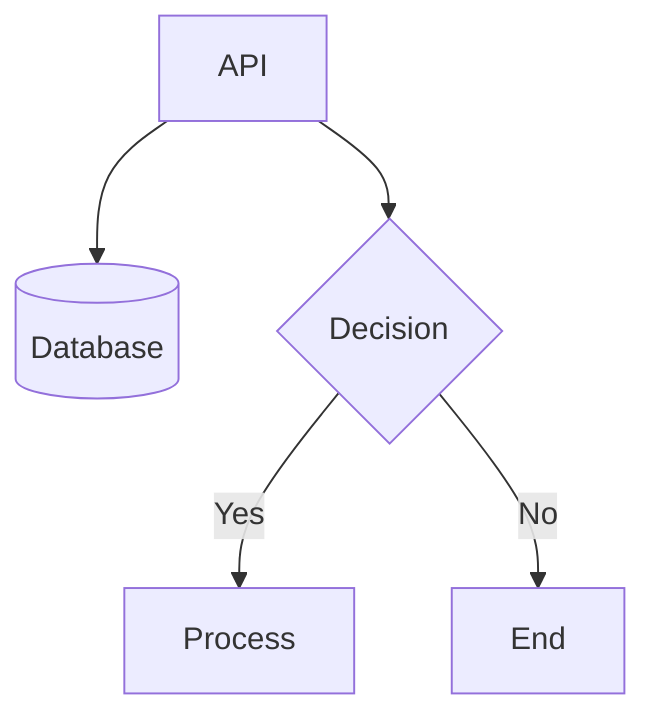
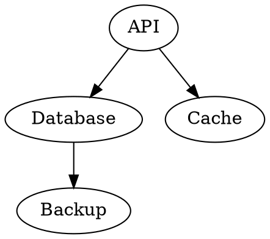

# Coral User Guide

Complete reference for Coral's visual diagramming editor.

## Table of Contents

- [Editor Overview](#editor-overview)
- [Text Editing](#text-editing)
- [Visual Editing](#visual-editing)
- [Coral DSL Reference](#coral-dsl-reference)
- [Notation Systems](#notation-systems)
- [Layout Configuration](#layout-configuration)
- [File Management](#file-management)
- [Keyboard Shortcuts](#keyboard-shortcuts)
- [Importing Other Formats](#importing-other-formats)

---

## Editor Overview

The Coral editor has three panels:

```
┌─────────────┬──────────────────────┬─────────────┐
│   Text      │      Visual          │  Inspector  │
│   Editor    │      Canvas          │   Panel     │
│             │                      │             │
│  Write DSL  │   Interactive        │  Settings   │
│  here       │   diagram            │  & Props    │
└─────────────┴──────────────────────┴─────────────┘
```

- **Text Editor** (left) — Write Coral DSL or Mermaid syntax
- **Visual Canvas** (center) — Interactive diagram with drag-and-drop
- **Inspector Panel** (right) — Document settings or selected node properties

Changes in any panel sync to the others automatically.

---

## Text Editing

### The Text Panel

The left panel is a code editor with:
- Line numbers
- Syntax highlighting
- Error reporting (red underline for syntax errors)

### Format Selection

Use the dropdown above the text editor to switch between:
- **Coral DSL** — Native format with full feature support
- **Mermaid** — Mermaid flowchart syntax

When you switch formats, the diagram content is preserved and converted.

### Live Parsing

As you type, Coral parses the text and updates the visual diagram. If there's a syntax error, the diagram shows the last valid state and the error appears below the editor.

---

## Visual Editing

### Canvas Interactions

| Action | Effect |
|--------|--------|
| Click node | Select it, show properties in Inspector |
| Drag node | Move it (position is preserved on reflow) |
| Scroll wheel | Zoom in/out |
| Click + drag background | Pan the view |
| Click edge | Select it |

### Floating Toolbar

The toolbar in the bottom-right provides:

| Button | Action | Shortcut |
|--------|--------|----------|
| Zoom In | Increase zoom level | — |
| Zoom Out | Decrease zoom level | — |
| Fit View | Fit diagram to viewport | — |
| Reflow | Re-run automatic layout | Ctrl+Shift+L |
| Undo | Undo last layout change | Ctrl+Z |
| Redo | Redo layout change | Ctrl+Shift+Z |

### Position Stability

When you drag a node, its position is preserved even when you edit the DSL. Coral tracks user-positioned nodes separately from auto-laid-out nodes.

To reset a node to automatic positioning, use **Reflow** (Ctrl+Shift+L).

### Edge Connections

To reconnect an edge:
1. Click and drag the edge endpoint
2. Drop it on a different node
3. The DSL updates automatically

Edge colors indicate compatibility:
- **Default** — Valid connection for the notation
- **Orange/Amber** — Warning (unusual but allowed)
- **Red** — Invalid connection for this notation

---

## Coral DSL Reference

### Node Declarations

```coral
type "Label"
```

Available types:

| Type | Visual | Use For |
|------|--------|---------|
| `service` | Rounded rectangle | APIs, microservices, apps |
| `database` | Cylinder | Databases, data stores |
| `module` | Rectangle | Internal components |
| `external_api` | Cloud shape | Third-party services |
| `actor` | Person icon | Users, clients |
| `group` | Container | Logical groupings |

### Node Properties

Add properties inside curly braces:

```coral
service "Payment API" {
  description: "Handles payments"
  technology: "Node.js"
  port: "3000"
}
```

### Nested Nodes

Nodes can contain child nodes:

```coral
group "Backend" {
  service "API"
  database "Cache"
}
```

### Edge Declarations

Basic syntax:

```coral
source_id -> target_id
```

Node IDs are derived from labels by lowercasing and replacing spaces with underscores:
- `"Payment API"` → `payment_api`
- `"PostgreSQL"` → `postgresql`

With relation type:

```coral
api -> database [data_flow]
```

With attributes:

```coral
api -> queue [event, label="OrderCreated", async=true]
```

Common relation types:
- `data_flow` — Data transfer
- `http_request` — HTTP/REST call
- `event` — Async event/message
- `depends_on` — Dependency relationship

### Comments

```coral
// This is a comment
service "API"  // Inline comment
```

### Complete Example

```coral
// E-commerce Architecture
actor "Customer"
service "Web Frontend"
service "API Gateway"
service "Order Service"
service "Payment Service"
database "PostgreSQL"
external_api "Stripe"

customer -> web_frontend [http_request]
web_frontend -> api_gateway [http_request]
api_gateway -> order_service [http_request]
api_gateway -> payment_service [http_request]
order_service -> postgresql [data_flow]
payment_service -> stripe [http_request]
```

---

## Notation Systems

Notations define how diagrams look and which connections are valid.

### Available Notations

| Notation | Best For | Node Shapes |
|----------|----------|-------------|
| **Flowchart** | Process flows, decisions | Rectangles, diamonds |
| **Architecture** | System diagrams | Services, databases, clouds |
| **BPMN** | Business processes | Tasks, events, gateways |
| **ERD** | Data modeling | Entities, relationships |
| **Code** | Software structure | Classes, modules, functions |

### Changing Notation

1. Open the Inspector panel (right side)
2. Select the **Document** tab
3. Choose a notation from the dropdown

The diagram re-renders with notation-appropriate symbols.

### Connection Rules

Each notation has rules about valid connections. For example:
- In **Flowchart**, decisions (diamonds) typically connect to processes
- In **ERD**, entities connect through relationships
- In **Architecture**, services can connect to databases

Invalid connections show as red edges with a warning tooltip.

---

## Layout Configuration

### Layout Algorithms

Coral uses ELK (Eclipse Layout Kernel) for automatic layout.

| Algorithm | Best For |
|-----------|----------|
| **Layered** (default) | Hierarchical flowcharts |
| **Tree** | Tree structures, org charts |
| **Force** | Network graphs |
| **Radial** | Circular layouts |

### Layout Presets

The Inspector panel offers presets:

| Preset | Algorithm | Direction | Spacing |
|--------|-----------|-----------|---------|
| Flowchart | Layered | Down | Medium |
| Org Chart | Tree | Down | Wide |
| Network | Force | — | Medium |
| Radial | Radial | — | Wide |
| Custom | User-defined | User-defined | User-defined |

### Manual Configuration

Expand "Layout Options" in the Inspector to configure:
- **Direction** — DOWN, RIGHT, UP, LEFT
- **Node Spacing** — Horizontal gap between nodes
- **Layer Spacing** — Vertical gap between layers
- **Edge Routing** — Orthogonal, polyline, spline

### When Layout Runs

Layout does NOT run automatically when you:
- Edit the DSL
- Change settings

You control when layout runs by clicking **Reflow** or pressing Ctrl+Shift+L.

This preserves your manual node positioning.

---

## File Management

### Save and Load

Use the file controls in the toolbar:
- **Save** — Download diagram as `.coral` file
- **Load** — Open a `.coral` file

### File Format

Coral files (`.coral`) are JSON documents containing:
- Diagram content (DSL text or Graph-IR)
- Document settings (notation, layout options)
- View state (zoom, pan, selection)
- Node positions (including user-dragged positions)

### Auto-Recovery

The editor auto-saves to browser localStorage. If the browser crashes or closes unexpectedly, your work is recovered on next visit.

---

## Keyboard Shortcuts

| Shortcut | Action |
|----------|--------|
| Ctrl+Shift+L | Reflow (run automatic layout) |
| Ctrl+Z | Undo layout change |
| Ctrl+Shift+Z | Redo layout change |
| Ctrl+S | Save diagram |
| Escape | Deselect all |

---

## Importing Other Formats

### Mermaid

Switch the format dropdown to "Mermaid" and paste Mermaid syntax:



Coral converts it to Graph-IR and renders it visually.

### Graphviz DOT

DOT import is available via the MCP server or programmatically:



### Converting to Coral DSL

After importing Mermaid or DOT:
1. Switch the format dropdown to "Coral DSL"
2. The content is converted to native Coral syntax
3. You now have full Coral feature support

---

## Tips and Best Practices

### Keep Diagrams Focused
- One diagram per concept or flow
- Use groups to organize related nodes
- Don't exceed 20-30 nodes for readability

### Use Meaningful Labels
- Labels become node IDs (lowercase, underscores)
- Keep them short but descriptive
- Avoid special characters

### Leverage Notations
- Choose the right notation for your diagram type
- Let the notation guide valid connections
- Don't fight the notation's conventions

### Position Strategically
- Let auto-layout do initial positioning
- Manually adjust only key nodes
- Use Reflow to reset when things get messy
