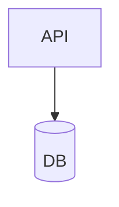

# /coral-convert

Convert diagrams between formats.

## Usage

```
/coral-convert <format>
<diagram content>
```

Or reverse conversion:
```
/coral-convert to-<format>
<coral dsl>
```

## Supported Formats

### Input (to Coral)
- `mermaid` / `mmd` - Mermaid flowcharts
- `graphviz` / `dot` - Graphviz DOT
- `plantuml` / `puml` - PlantUML component diagrams
- `json` - Graph-IR JSON to Coral DSL

### Output (from Coral)
- `to-mermaid` - Coral to Mermaid
- `to-dot` - Coral to Graphviz DOT
- `to-json` - Coral DSL to Graph-IR JSON

## Format Mappings

### Mermaid → Coral
| Mermaid | Coral |
|---------|-------|
| `A[Label]` | `service "Label"` |
| `A[(Label)]` | `database "Label"` |
| `A{{Label}}` | `external_api "Label"` |
| `subgraph Name` | `group "Name" { }` |

### Graphviz → Coral
| Graphviz | Coral |
|----------|-------|
| `shape=box` | `service` |
| `shape=cylinder` | `database` |
| `subgraph cluster_X` | `group "X" { }` |

## Examples

### Mermaid to Coral
```
/coral-convert mermaid
graph TD
  A[API Gateway] --> B[Auth Service]
  A --> C[User Service]
  B --> D[(Database)]
```
Output:
```coral
service "API Gateway"
service "Auth Service"
service "User Service"
database "Database"

api_gateway -> auth_service
api_gateway -> user_service
auth_service -> database [data_flow]
```

### Coral to Mermaid
```
/coral-convert to-mermaid
service "API"
database "DB"
api -> db [data_flow]
```
Output:


## Conversion Notes

The skill includes notes when:
- Features are not supported in target format
- Style information is lost
- Assumptions are made

## Limitations

- Styling (colors, line styles) not preserved
- Interactivity (click handlers) not supported
- Layout hints noted but not in IR
